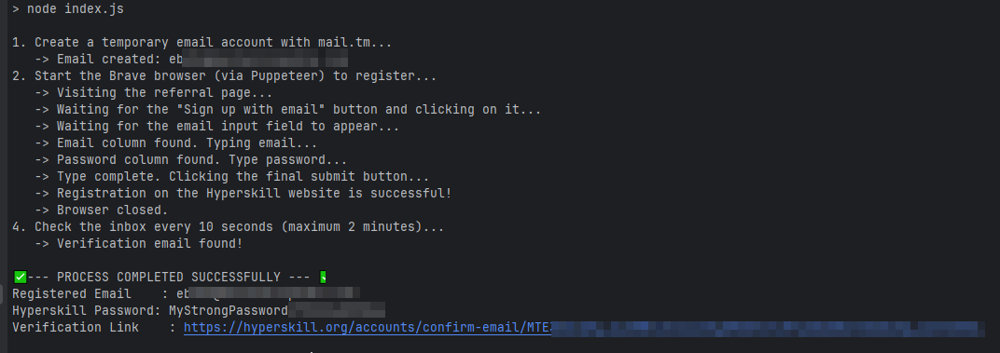
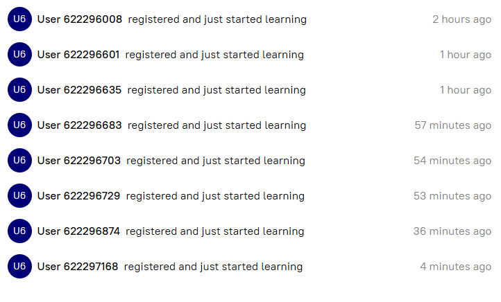

# Hyperskill Account Automation Bot

This is a Node.js script that automates the account registration process on Hyperskill through a referral link. It is
designed to handle modern, dynamic websites that are protected by anti-bot measures by using a real browser instance for
automation.

## Features

- **Automated Registration:** Fully automates the process of visiting a referral link, filling out the registration
  form, and submitting it.
- **Browser Automation:** Uses Puppeteer to control a local Brave or Chrome browser, enabling it to execute JavaScript
  and interact with dynamic page elements.
- **Temporary Email Integration:** Automatically creates a temporary email account via the `mail.tm` API for
  registration.
- **Verification Link Retrieval:** After registration, it polls the temporary email inbox, finds the confirmation email,
  and extracts the verification link.
- **Modular and Configurable:** The codebase is structured into separate services for browser interaction and email
  handling. Key settings are managed through a `.env` file for easy configuration.
- **Error Handling:** Includes error handling with screenshots on failure for easier debugging.

## Technology Stack

- **Runtime:** Node.js
- **Browser Automation:** [Puppeteer](https://pptr.dev/)
- **Temporary Email Service:** [@cemalgnlts/mailjs](https://www.npmjs.com/package/@cemalgnlts/mailjs)
- **Configuration:** [dotenv](https://www.npmjs.com/package/dotenv)

## Prerequisites

- [Node.js](https://nodejs.org/) (v16 or higher)
- A Chromium-based browser installed (e.g., Brave, Google Chrome)

## Setup and Configuration

1. **Clone the repository:**
   ```sh
   git clone https://github.com/aritlhq/hyperskill-gems-farmer-bot.git
   cd hyperskill-gems-farmer-bot
   ```

2. **Install dependencies:**
   ```sh
   npm install
   ```

3. **Create a configuration file:**
    - Rename the `.env-example` file to `.env`.
    - Open the new `.env` file and edit the variables:

   ```env
   # Replace with your own Hyperskill referral link
   REFERRAL_URL="https://hyperskill.org/join/your_referral_code"

   # Update with the absolute path to your browser's executable file
   BROWSER_EXECUTABLE_PATH="C:/Program Files/BraveSoftware/Brave-Browser/Application/brave.exe"
   ```

   *Note: Use forward slashes (`/`) or double backslashes (`\\`) for the path on Windows.*

## Usage

Run the script from your terminal using the following command:

```sh
npm start